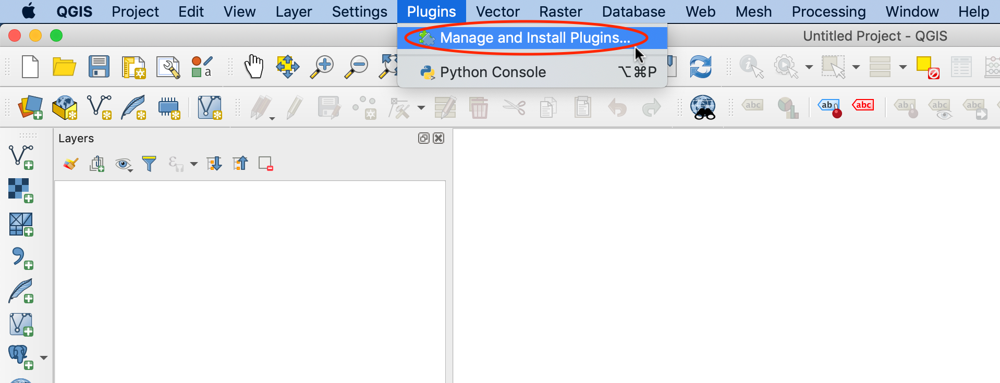
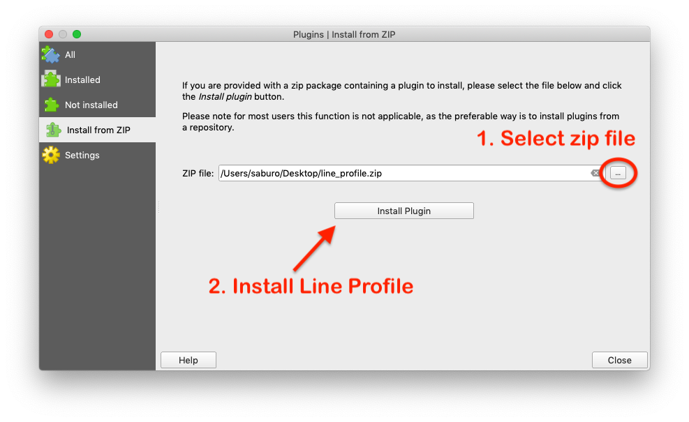

# Line Profile

A QGIS plugin for creating line profiles from vector and raster layers.

## Contents

${toc}

## Requirement

- QGIS (ver. 3.10+).

For `QGIS 2` users, use [older version]('htts://github.com/saburo/LineProfile_QGIS2').

## Installation

There are two ways to install `Line Profile`.

### Install from QGIS Plugin Repository

To be updated (TBU)

<!-- 1. Open QGIS. -->
<!--  -->
<!-- 2. From the QGIS menu, select `Plugins` > `Manege and Install Plugins`. -->
<!--     -->
<!--  -->
<!-- 3. Search/find `Line Profile` from the plugin list and click `Install Plugin` button on the right bottom of `Manege and Install Plugins` window. -->
<!--     -->
<!--  -->
<!-- 4. Select `Installed Plugins` to make sure `Line Profile` was correctlly installed. If it is not checked, click the checkbox (on the left of green puzzle piece icon) to activate the plugin. You also see `Line Profile` icon in the QGIS toolbar. -->
<!--  -->

### Install from ZIP file

Manual installation is also available.

1. Download `Line Profile` (line_profile.zip) from [WiscSIMS GitHub repository](https://github.com/wiscsims/line_profile/releases/latest).

2. Open QGIS.

3. From the QGIS menu, select `Plugins` > `Manege and Install Plugins`.
   

4. Select `Intall from ZIP` and hit `...` button to select downloaded `line_profile.zip` file.
   

5. Hit `Install Plugin` to install `Line Profile`.
6. Select `Installed Plugins` to make sure `Line Profile` was correctlly installed. You also see `Line Profile` icon in the QGIS toolbar.

## Quick Start

- Select a layer from the layer panel.
- Hit `Add Data` button, then choose an item you want to plot.
- Make a profile line with:
  - Click on canvas to start your profile line (circle marker: ●).
  - You can add vertics by clicking on canvas (●).
  - Right click on canvas to terminate the profile line (square marker: ■).
- Done! 🎉 - The line profile is generated automatically.

## Usage

### Creating Line Profiles

You can create profile lines with clicking on canvas.

- **Start profile line/Create verrtics**: `Left Click`
- **Terminate profile line**: `Right Click`
- **Cancel/Clear profile line**: `Double Click`

<!-- #### On Raster Layers -->
<!--  -->
<!-- TBU -->
<!--  -->
<!-- #### On Vector Layers -->
<!--  -->
<!-- TBU -->

#### Multiple Profile Lines

There are two profile lines (Profile Line 1 and Profile Line 2).

#### Tieline

A thin yellow line indicating where the each data point in the vector layer is projected on the profile line. `Default: On`.

#### Tracking Marker

A marker on the profile line indicating the location of the data in the plot. `Default: Off`.

### Export Data

Data used in the plot can be exported as text data with csv format.

### Import/Export Profile Line

Profile lines are also exportable as shape file. You can reproduce the profile line and plots.

### Save Plot

Plots can be saved as raster or vector file with various format (jpg, png, pdf, svg).

## Options

TBU

## Developmental Features

### Checking sampling points and area visually

_Heavy processing, though._

- as a shaded area
- as points

### Normalize to `Profile Line 1`
