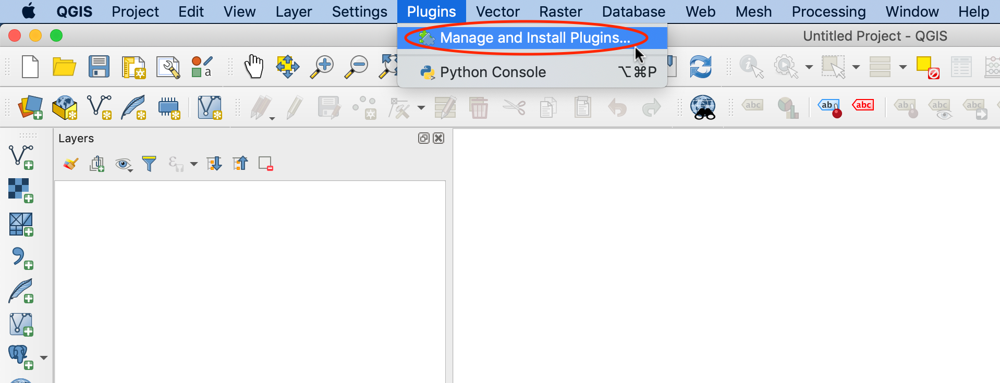
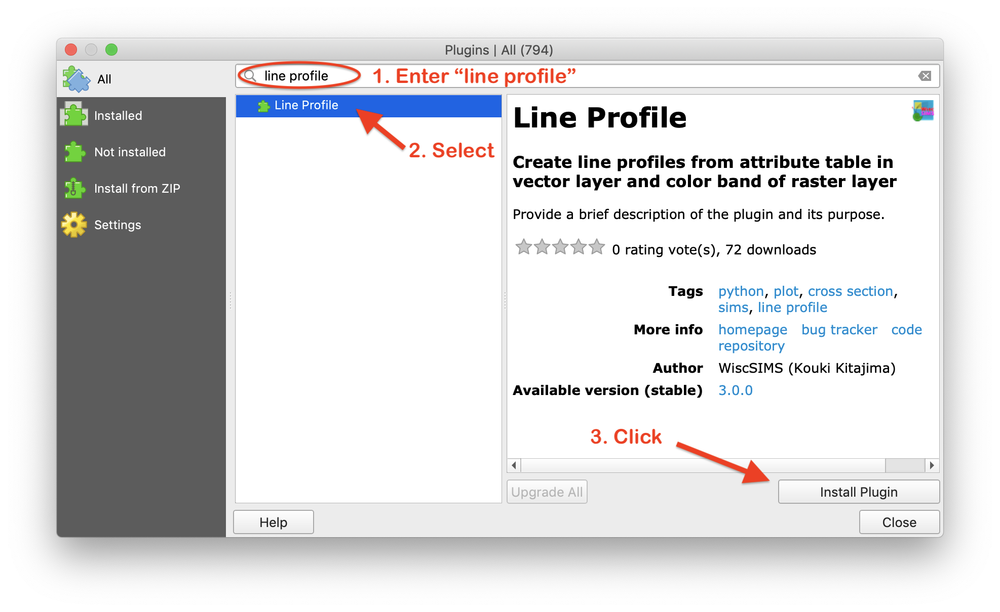
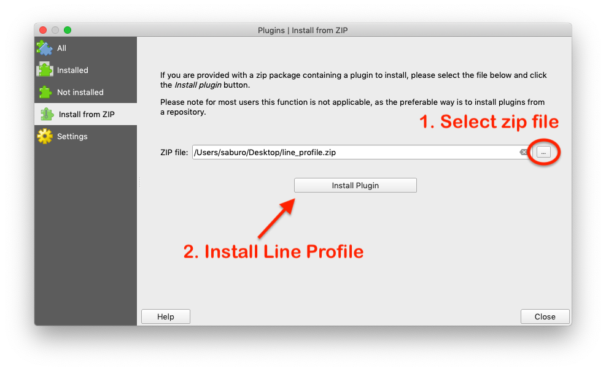

# Line Profile

A QGIS plugin for creating line profiles from vector and raster layers.

## Contents

- [Requirement](#requirement)
- [Installation](#installation)
  - [Install from QGIS Plugin Repository](#install-from-qgis-plugin-repository)
  - [Install from ZIP file](#install-from-zip-file)
- [Quick Start](#quick-start)
- [Usage](#usage)
  - [Creating Line Profiles](#creating-line-profiles)
  - [Adding and Managing Plot Data](#adding-and-managing-plot-data)
  - [Plot Options](#plot-options)
    - [Profile Smoothing](#profile-smoothing)
  - [Profile Lines](#profile-lines)
  - [Tie Lines](#tie-lines)
  - [Tracking Marker](#tracking-marker)
  - [Sync Plot to Map Extent](#sync-plot-to-map-extent)
  - [Peak / Valley Detection](#peak--valley-detection)
  - [Save Plot](#save-plot)
- [Options](#options)
  - [Export Profile Data](#export-profile-data)
  - [Import and Export Profile Lines](#import-and-export-profile-lines)
  - [Scaling](#scaling)
- [Development Tab](#development-tab)
  - [Sampling Areas and Sampling Points](#sampling-areas-and-sampling-points)
  - [Normalization of Profile Lines](#normalization-of-profile-lines)
- [Manual QGIS Test](#manual-qgis-test)

## Requirement

- QGIS 3.10 or newer. The plugin metadata declares the same minimum version.

For QGIS 2 users, use the [older QGIS 2 version](https://github.com/saburo/LineProfile_QGIS2).

## Installation

There are two ways to install `Line Profile`.

### Install from QGIS Plugin Repository

1. Open QGIS.
2. From the QGIS menu, select `Plugins` > `Manage and Install Plugins`.
   <a href="img/readme/plugin_install_menu.png" target="_blank"></a>
3. Select the `All` tab, search for `Line Profile`, and click `Install Plugin`.
   <a href="img/readme/plugin_install.png" target="_blank"></a>
4. Select `Installed` and make sure `Line Profile` is enabled. The `Line Profile` icon should also appear in the QGIS toolbar.

### Install from ZIP file

1. Download `line_profile.zip` from the [latest WiscSIMS Line Profile release](https://github.com/wiscsims/line_profile/releases/latest).
2. Open QGIS.
3. From the QGIS menu, select `Plugins` > `Manage and Install Plugins`.
   <a href="img/readme/plugin_install_menu.png" target="_blank"></a>
4. Select `Install from ZIP`, choose the downloaded `line_profile.zip`, and click `Install Plugin`.
   <a href="img/readme/plugin_install_zip.png" target="_blank"></a>
5. Select `Installed` and make sure `Line Profile` is enabled.

## Quick Start

1. Select a raster or vector layer in the QGIS Layers panel.
2. Click **Add Data** in the Line Profile dock.
3. Choose the raster band or numeric vector attribute to plot.
4. Draw a profile line on the map:
   - Left click to start the profile and add vertices.
   - Right click to terminate the profile.
5. The profile is sampled and plotted automatically.

You can add multiple data series from different raster and vector layers. Two profile lines are available and can be selected from the profile-line selector.

## Usage

### Creating Line Profiles

Profile lines are drawn directly on the QGIS map canvas.

- **Start profile line / add vertex:** `Left Click`
- **Terminate profile line:** `Right Click`
- **Clear/reset the current profile line:** use the **Clear** button next to the profile-line selector
- **Reset while drawing:** `Double Click`

A profile may contain multiple line segments. Segment boundaries are shown in the plot as vertical dotted lines.

### Adding and Managing Plot Data

Select a layer in the QGIS Layers panel and click **Add Data**.

- For a **raster layer**, choose a raster band.
- For a **vector layer**, choose a numeric attribute field.

Each added data series appears in the table on the right side of the Plot tab.

The table allows you to:

- enable or disable a plotted series with its checkbox
- change the plotted band or attribute
- change the plot color
- open the data configuration dialog

Double-click the corresponding table cell to edit the color, data selection, or configuration.

If a source layer is removed from the QGIS project, or is no longer visible when the plugin refreshes its data model, the corresponding plot entry is removed or disabled automatically.

### Plot Options

Open the configuration for an individual data series from the plot-data table.

Common plot options include:

- enable or disable the series
- change the plot label
- change the plot color
- select a marker symbol and marker size
- change line width
- remove the data series

#### Raster Layer Options

Raster profiles support the following options:

- **Full Resolution**: sample using the raster's native resolution. For non-square raster pixels, Line Profile uses the finer of the raster X/Y resolutions to avoid undersampling the profile.
- **Area Sampling (half width)**: sample multiple points perpendicular to the profile line and plot their average. The entered value is the half width in µm.

Area Sampling is performed before profile smoothing.

#### Profile Smoothing

Raster profiles have one **Smoothing** selector. It creates one processed profile that is used consistently by the plot, Profile Data export, Peak / Valley Detection, and manual Peak / Valley snapping. The original sampled profile remains unchanged.

- **None**: plot and analyse the sampled profile without smoothing.
- **Moving Average**: apply an N-point centered moving average. The window size is measured in samples. Positions near the start or end that cannot contain a full window are left empty rather than shortening or shifting the profile.
- **Gaussian**: apply Gaussian smoothing. **Gaussian σ** is entered in µm, then converted to samples separately for each continuous valid run using the run's median positive profile-distance spacing.

Neither method crosses NoData gaps. A value of `0 µm` for Gaussian σ leaves the profile unchanged. Changing only smoothing settings reuses the cached raw samples when possible; it does not require a new raster sample pass. Gaussian smoothing requires SciPy. If SciPy is unavailable, Line Profile offers to install it for the active QGIS user profile and does not silently substitute the raw profile.

#### Vector Layer Options

Vector profiles project point features onto the profile line.

- **Max Distance From The Line** sets the maximum perpendicular distance, in µm, at which a vector point can contribute to the profile.
- The same maximum-distance setting is applied to other plotted fields from the same vector layer.
- If features are selected in the vector layer, the profile uses the selected features; otherwise it uses all available features.

### Profile Lines

Line Profile provides two independent profile lines:

- <span style="color:red;">Profile Line 1</span>
- <span style="color:blue;">Profile Line 2</span>

Choose the active line with the profile-line selector. The **Clear** button resets only the currently selected profile line.

When both profile lines contain data, they are drawn together so the same data series can be compared along the two profiles.

### Tie Lines

**Tie Lines** is enabled by default.

For vector data, a thin line is drawn on the map from each contributing vector point to the position where that point is projected onto the profile line. This makes it easier to see which map features correspond to values in the profile plot.

### Tracking Marker

**Tracking Marker** is disabled by default.

When enabled, moving the pointer over the profile plot displays a marker at the corresponding position on the profile line in the QGIS map canvas. The coordinate conversion also follows the active profile normalization mode.

### Sync Plot to Map Extent

Enable **Sync plot to map extent** to display only the portions of the profile lines that are currently visible in the QGIS map canvas.

When enabled:

- zooming or panning the map automatically updates the visible portion of the plot
- only profile sections intersecting the current map extent are drawn
- if a profile enters the map extent more than once, separated visible sections remain separated in the plot rather than being joined together
- the original profile-distance axis is preserved
- profile data are not re-sampled simply because the map extent changed; the plugin reuses the existing sampled data and changes only what is displayed
- smoothing is calculated from the full sampled profile before the map-extent mask is applied
- the Tracking Marker follows only currently visible portions of the profile

The option is disabled by default. Turning it off immediately restores the complete profile.

### Peak / Valley Detection

Peak / Valley Detection uses SciPy's `scipy.signal.find_peaks` to find local maxima and minima in the current processed raster profile. Valleys are detected from the inverted signal. Peaks are shown as red upward triangles and valleys as blue downward triangles on the plot. Corresponding markers can also be displayed on the QGIS map.

#### Automatic detection

1. Add a raster band with **Add Data** and draw a profile line.
2. In **Peak / Valley Detection**, choose the plotted raster series from **Data**.
3. Enable **Detect Peaks**, **Detect Valleys**, or both.
4. Adjust the detection parameters described below.
5. Click **Auto Detect**. Change the parameters and click it again to replace the previous automatic results for the current profile and data series. Manually added points are preserved.

The **Data** list contains only checked raster series that are currently available to the plot. Detection is performed independently for each continuous run of valid samples, so a NoData gap is never treated as part of a peak or valley.

| Parameter | Default | Meaning |
| --- | ---: | --- |
| **Detect Peaks** | On | Detect local maxima in the profile. |
| **Detect Valleys** | On | Detect local minima by applying the same detection logic to the inverted profile. Reported values remain the original, non-inverted values. |
| **Prominence mode** | `Absolute` | Chooses an absolute or locally adaptive prominence threshold. |
| **Minimum / Range % / multiplier** | `0` | Threshold value for the selected prominence mode. `0` applies no prominence constraint. |
| **Window** | `100 µm` | Total physical width of the adaptive neighborhood centered on each candidate. It is disabled in Absolute mode. |
| **Min distance** | `0 µm` | Minimum separation between neighboring peaks or neighboring valleys along the profile, measured in µm. A larger value suppresses closely spaced detections of the same type. `0` applies no distance constraint. |
| **Min width** | `0 µm` | Minimum feature width along the profile, measured in µm. Width is measured at approximately half of the feature prominence using the profile's actual x coordinates. A larger value rejects narrow features. `0` applies no width constraint. |

#### Processing, units and filtering

**Auto Detect** asks SciPy for peak or valley candidates and their properties from the same processed profile displayed in the plot. A common post-candidate stage then applies prominence, Min width, and Min distance in that order. This filtering stage is independent of the candidate finder so future detection methods can reuse the same rules. A detected feature's reported value is the processed-profile value at its sample position.

Prominence modes use these thresholds:

- **Absolute:** the entered minimum prominence in intensity units. This is the original behavior and remains the default.
- **Local range %:** `local (max - min) × percentage / 100`.
- **Local SD:** `multiplier × local standard deviation`.
- **Local MAD:** `multiplier × 1.4826 × median(abs(y - median(y)))`.

The adaptive neighborhood is selected from raw profile x coordinates using half of **Window** on either side of the candidate. The stored Window is therefore the total width in µm, not a sample count. At a finite-run edge, Line Profile uses only the available part of the window without padding. NaN/NoData gaps and Detection Scope boundaries stop the neighborhood, so a separate speleothem chunk or excluded range cannot affect a candidate's threshold.

- **Min distance** filters peaks and valleys independently after candidate detection. Features closer than the specified distance compete by prominence, then detection-signal height.
- **Min width** uses SciPy's fractional `left_ips` and `right_ips` width positions. Line Profile interpolates both positions on the actual profile x coordinates, so the stored feature `width` and the threshold are both in µm.
- **Snap ±** remains sample-based.

SciPy is required for **Auto Detect** and for Gaussian smoothing. If it is unavailable, Line Profile asks for permission before installing it into the active QGIS user's `python/dependencies` directory. Manual editing remains available without SciPy when Gaussian smoothing is not selected.

For a noisy profile, first increase **Prominence** slightly. If noise still produces clusters of points, increase **Min distance** or choose a small smoothing setting in the raster data configuration. If a real narrow feature is missing, reduce **Min width** or disable it with `0`.

#### Manual editing

Choose a mode and left click the profile plot:

| Mode | Behavior |
| --- | --- |
| **Select** | Does not change Peak or Valley records. This is the default mode. |
| **+ Peak** | Finds the largest processed value within **Snap ±** samples of the click and adds a manual peak there. |
| **+ Valley** | Finds the smallest processed value within **Snap ±** samples of the click and adds a manual valley there. |
| **Delete** | Deletes the nearest automatic or manual point when it is within **Snap ±** samples of the click. |

**Snap ±** defaults to `5` samples. This means an addition searches from five samples before the clicked sample through five samples after it, clipped at the ends of the profile. You do not need to click the exact peak or valley. Adding the same classification at the same sample does not create a duplicate. Adding the opposite classification at that sample reclassifies it as the newly selected manual type.

Manual and imported points survive **Auto Detect** and **Clear Auto**. They are cleared when **Clear All** is confirmed or when the associated profile geometry or raster sampling configuration changes so that the saved sample positions are no longer valid.

#### Display, clearing, and output

- **Show points on map** shows or hides markers for the current profile and selected raster series without deleting the records.
- **Clear Auto** removes only automatic records for the current profile and selected raster series. Manual and imported points remain.
- **Clear All** removes all stored Peak and Valley records. Confirmation is required when manual or imported records exist.
- The point count applies to the current profile and selected raster series.
- **Create Point Layer** in the **Points...** menu creates a temporary QGIS memory layer named `Line Profile Peaks Valleys`. It includes all stored records and the fields `feature_id`, `type`, `source`, `profile`, `data`, `raster_id`, `sample_idx`, `distance`, `value`, `prominence`, and `width`. Save or export this memory layer if it must persist after the QGIS project is closed.

#### Importing and exporting points

Use the **Points...** menu in the Peak / Valley Detection panel to import points, export the current profile and data series, or export all stored points. CSV (`.csv`), TSV (`.tsv`), and text (`.txt`) files are supported. Plugin exports are portable and can be imported again.

Exported files include these columns:

```text
type, source, profile, data, distance_um, value, sample_index, prominence, width_um, map_x, map_y
```

A minimal external file needs only `distance_um,type`, for example:

```csv
distance_um,type
1234.5,peak
1456.8,valley
```

If the `type` column is absent, Line Profile asks whether the rows are Peaks or Valleys. Import always targets the currently selected Profile Line and Peak Detection data series; saved layer IDs, profile numbers, values, and map coordinates in the file are not reused. Each `distance_um` is snapped to the nearest current raw profile sample. Distances outside the current profile are rejected rather than clamped. The plugin recalculates the snapped distance, processed value, and map location, then stores new records as `imported`.

Only one point can occupy a sample: a duplicate of the same type is skipped, while an opposite type replaces the existing classification. Malformed or out-of-range rows do not prevent valid rows from importing; their original row numbers are reported after import. Imported points remain editable using + Peak, + Valley, and Delete, and are included in the confirmation for **Clear in Scope** and **Clear All**.

### Save Plot

Click **Save Plot** to save the current plot as one of the supported Matplotlib output formats:

- PDF
- PNG
- JPEG
- SVG

The saved figure reflects the plot currently displayed. For example, when **Sync plot to map extent** is enabled, the saved plot reflects the currently visible profile ranges.

## Options

The **Options** tab contains profile-data export, profile-line import/export, and distance scaling controls.

### Export Profile Data

Click **Profile Data** under **Export** to save the data for the currently selected profile line.

Supported formats are:

- tab-delimited text (`.txt`)
- comma-separated values (`.csv`)

Each plotted data series is exported with its profile distance and the exact same processed data values currently used by the plot and Peak / Valley Detection. Export preserves the full profile, including empty edge positions created by Moving Average.

Map-extent synchronization is a display-only feature and does not truncate the exported profile data.

### Import and Export Profile Lines

#### Import

Click **Profile Line** under **Import**.

A profile can be imported from:

- an ESRI Shapefile containing a single line feature
- an eligible single-feature line layer already loaded in QGIS

For multipart input, the first polyline part is used. After import, the line is drawn on the map and the profile is recalculated.

#### Export

Click **Profile Line** under **Export**.

The export dialog can:

- save the current profile line as an ESRI Shapefile
- optionally add the saved Shapefile back to the QGIS map
- optionally add a distance field to the currently plotted vector layer(s)

The distance-field name is limited to 10 characters because the output workflow uses the Shapefile field-name limit.

### Scaling

The **Pixel Size** setting converts map/canvas distance to profile distance in µm. The default value is `1.000`.

Internally, Line Profile multiplies map distance by this value to create the x-axis distance used by the profile plot. The plot x-axis is therefore displayed as `Distance [µm]`.

You can enter Pixel Size manually or click **Open Alignment File...** to read a WiscSIMS alignment JSON file. The plugin supports both older alignment files containing a `scale` value and newer alignment files containing stage/canvas reference-point pairs.

For a valid alignment file, the calculated pixel size must be positive and finite.

## Development Tab

The **Development** tab contains tools for inspecting raster area sampling and for comparing two profile lines after normalization.

### Sampling Areas and Sampling Points

For raster profiles using Area Sampling, the plugin can display the sampling geometry directly on the QGIS map.

- **Sampling Areas** shows the area used for perpendicular profile sampling.
- **Sampling Points** shows the individual sampling positions.
- Use the data selector in this group to choose the raster data series whose sampling geometry should be displayed.

These visualization options are intended primarily for checking how raster values are being sampled and may be expensive for densely sampled profiles.

### Normalization of Profile Lines

Enable **Normalized to Profile Line 1** to compare Profile Line 2 using the distance scale of Profile Line 1.

#### By Total Length

**By Total Length** scales the complete x-axis length of each profile so that its total profile length matches Profile Line 1.

#### By Segment

**By Segment** normalizes each segment independently to the corresponding segment of Profile Line 1.

Both profile lines must contain the same number of segments for segment-by-segment normalization.

The normalization changes the displayed profile-distance coordinate only; it does not change the original map geometry.

## Manual QGIS Test

On macOS with QGIS installed in `/Applications/QGIS.app`, run:

```sh
tests/run_qgis_manual_test.sh
```

The launcher uses an isolated QGIS profile under `/private/tmp`, loads the current working tree directly, and creates sample raster data, vector points, and a horizontal profile line. It can be used to check plotting, raster/vector sampling, profile-line behavior, map-extent synchronization, and other UI features without changing the normal QGIS profile.
